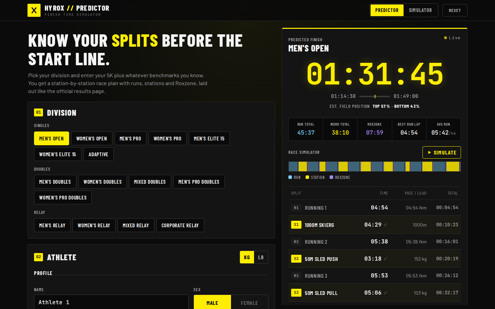
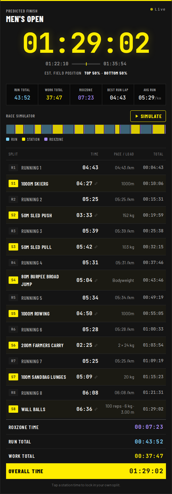
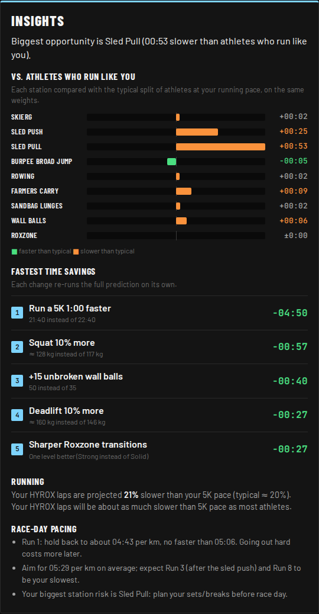
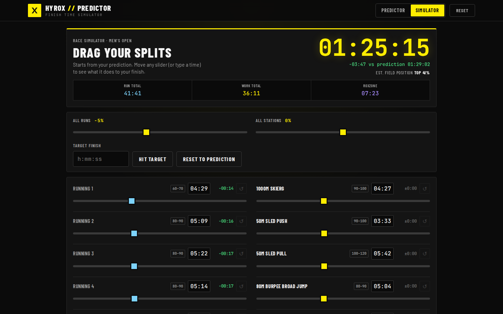
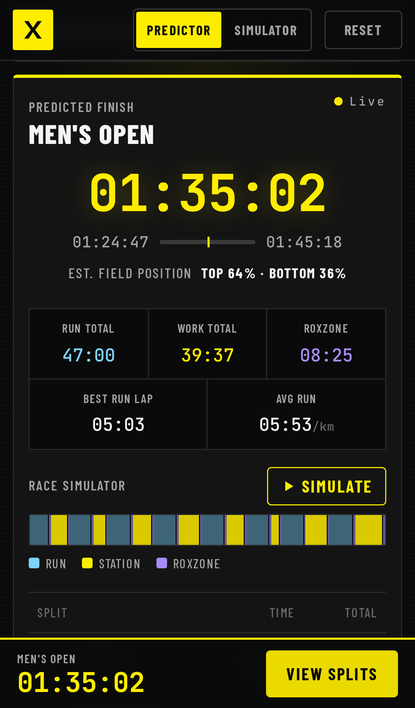

# HYROX Finish Time Predictor

**Live app: https://johnpapa.github.io/hyrox-predictor/**

A responsive Angular web app that predicts your HYROX finish time split by split: all 8 runs, all 8 stations, and Roxzone
time. It covers every division: Open, Pro, Elite 15, Adaptive, Doubles (Men/Women/Mixed and Pro), and Relay
(Men/Women/Mixed/Corporate). The look follows the dark, results-page style of HYROX timing, with a race-simulator timeline
you can play back.



**New here? Read the [screenshot tutorial](docs/TUTORIAL.md).**

| Results board | Insights | Simulator | iPhone |
|---|---|---|---|
|  |  |  |  |

## Features

- **Every division**, with the correct loads per station (Open/Pro sleds, bells, sandbag, wall ball and target). Mixed
  doubles, mixed relay and corporate relay load rules are handled per athlete.
- **Inputs that actually predict performance, with fallbacks for everything.** 5K is the anchor. Any benchmark can be
  left blank. Each ability (running, ergs, leg strength, pulling strength, grip, burpees, sleds, lunges, wall balls,
  Roxzone) falls back through related tests to a concrete Weak/Fair/Solid/Strong/Elite self-rating, then to "not sure".
  Related tests include other lifts with any rep count, other race distances, other erg distances, and dead hang or
  pull-ups. A confidence panel shows what each estimate is based on and which input would help most.
  A previous HYROX result calibrates the whole prediction.
- **Results laid out like the official page:** Running 1 … Wall Balls, then Roxzone Time, Run Total, Work Total and
  Overall Time. It also shows a confidence range and an estimated field position.
- **Doubles:** tune both partners. Each station's work split is auto-optimised, or you can drag it yourself.
- **Relay:** tune all four athletes. The fastest leg order is chosen automatically, or you can set it.
- **Lock in known splits:** tap any station time to override it.
- **Insights:** limiters and strengths compared with athletes who run at your pace, and the fastest time savings
  (each computed by re-running the model with one improvement). Also running and race-day pacing notes.
  Deterministic, with no AI.
- **Simulator page** (`#simulator`): drag a slider for every run, station and the Roxzone and watch the finish time
  and field position change. It shows which finish band each split is typical of, scales all runs or stations at
  once, and can solve for a target time.
- **Race simulator:** plays the race back along a run/station/Roxzone timeline.
- Supports kg and lb. Mobile-first, with a sticky summary dock on phones.

## AI analysis?

Should the app add Claude-powered coaching? See the research and recommendation in [docs/AI-ANALYSIS.md](docs/AI-ANALYSIS.md).
In short: keep the prediction deterministic (the rule-based Insights panel is now built), and if AI is ever added, make
it opt-in with bring-your-own-key. There are no plans to add it for now.

## Privacy

- **No servers, accounts, analytics or cookies.** The app is static files; every calculation runs in your browser.
- **Nothing is saved unless you opt in.** "Save my inputs on this device" keeps your inputs in this browser's
  `localStorage`. Unticking it deletes them. Local storage is used instead of cookies because cookies are sent to the
  server with every request.
- **No third-party requests.** Fonts are self-hosted, and a strict Content-Security-Policy blocks scripts, styles and
  connections to any other origin.

## Hosting

The app is hosted on GitHub Pages. `.github/workflows/deploy.yml` runs the tests, builds, and deploys on every push to
`main`. The build uses a relative `<base href="./">`, so the same output also works on Netlify, Cloudflare Pages, Azure
Static Web Apps, or any static file host.

## Run it

```bash
npm install
npm start                  # http://localhost:4200
npm test                   # unit tests (Vitest): model, conversions, realism personas, fuzzing
npm run e2e                # Playwright end-to-end tests on desktop + iPhone (production build)
npm run docs:screenshots   # regenerate the tutorial screenshots in docs/tutorial
npm run build              # production build in dist/
```

**Realism tests** (`src/app/core/realism.spec.ts`) check the predictions themselves, not just the code:
- **Personas:** a high-VO₂max runner never gets slow laps; a runner with no strength is slow on sleds and lunges; a
  strong lifter who can't run gets slow laps but fast sleds; beginners land in the 2–3 hour band; elites stay just
  above world records.
- **Benchmark effects:** each benchmark moves only the stations it should (e.g. dead hang → farmers carry and pull,
  not runs).
- **Monotonic cause and effect:** a faster 5K always means faster runs; more strength always means faster sleds.
- **Fuzzing:** 500 random athletes across all divisions, each checked against human limits for every split.

The end-to-end suite runs every user path against the production build (strict CSP, served under `/hyrox-predictor/`
like GitHub Pages) on desktop and iPhone viewports. It covers all 16 divisions, every input and fallback, key-by-key
typing, doubles and relay tactics, locked splits, the simulator, opt-in saving, reset, privacy (no cookies or
third-party requests) and responsive layout.

Requires Node 20.19+ / 22.12+ / 24+. Built with Angular 21: standalone components, signals, zoneless change detection
and the new control flow.

## How the model works

See [RESEARCH.md](RESEARCH.md) for the data and sources. In short:

1. **5K → HYROX run pace.** HYROX kilometres are about 20% slower than 5K pace for mid-pack athletes, about 12–15% for
   strong hybrid athletes and up to 30% for first-timers. Experience, training hours and Pro loads adjust this.
2. **Run pace → baseline station splits.** Medians from about 15k real results, interpolated by average run split.
3. **Personal adjustments** per station from erg times, strength ratios, bodyweight, wall-ball capacity and ratings.
4. **Doubles / relay combination models**, calibrated to the observed doubles/singles and relay ratios.

All tuning constants live in `src/app/core/model-params.ts` and `src/app/core/split-tables.ts`.

## Project layout

```
src/app/
  core/            pure TypeScript model: divisions, split tables, predictor, signal store
  components/      division picker, athlete form, team tactics, results board, methodology
```

_Unofficial fan-made tool. Not affiliated with or endorsed by HYROX._
