# How to use the HYROX Predictor

A five-minute walkthrough. Every field is optional: enter what you know, leave the rest blank, and the
prediction updates as you type.

**Open the app:** https://johnpapa.github.io/hyrox-predictor/

---

## 1. Pick your division

Choose Singles (Open, Pro, Elite 15, Adaptive), Doubles, or Relay. Loads such as sled weights, kettlebells, the sandbag
and the wall ball switch automatically. Divisions with special rules show a note, for example mixed doubles weights or
the doubles 10-second rule.

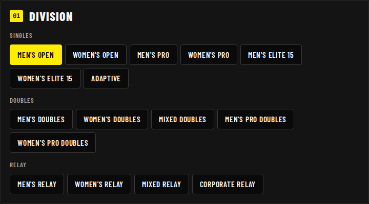

## 2. Tell it about yourself

Name, sex, bodyweight, age, HYROX experience and weekly training hours. Anything you don't know can stay on **Not sure**.
Age shows your HYROX age group. Under **Physiology** you can add a VO₂max (from a lab or a watch) and a resting heart
rate. These are only used when you have no race time.

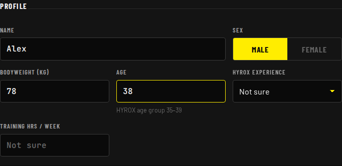

## 3. Running: the strongest predictor

Enter your current 5K best. No recent 5K? Open **Don't have that? Other ways to estimate** and enter a 10K, mile, half
marathon or Cooper test instead. The hint shows your projected HYROX run pace.

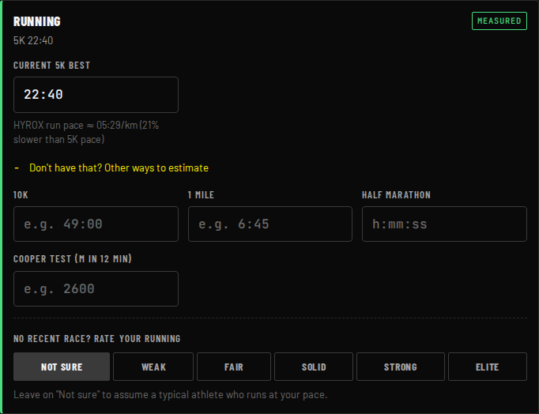

## 4. Strength: any lift, any reps

Enter a back squat or deadlift as weight × reps, and the app estimates your 1RM. No squat? A front squat, deadlift,
trap-bar, Romanian deadlift or leg press is converted for you.

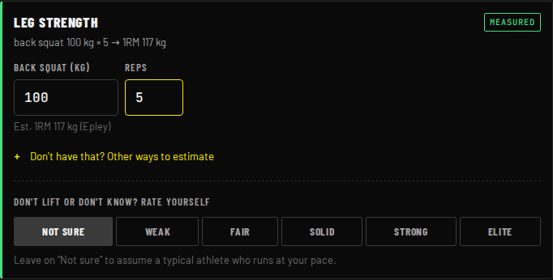

## 5. No numbers? Rate yourself

Every ability has a **Weak / Fair / Solid / Strong / Elite** scale. Each level has a concrete description, so
"Strong" means the same to everyone. **Not sure** assumes a typical athlete who runs at your pace. It never skews the
result; it only widens the range.

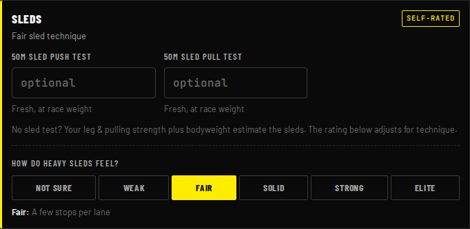

## 6. Station benchmarks

Grip (dead hang, pull-ups), burpees per minute, wall balls (max unbroken, 100 for time, or "Karen") and fresh station
tests (sled push/pull, lunges, farmers carry, burpee broad jumps) sharpen individual stations. Implausible entries are
ignored with a warning.

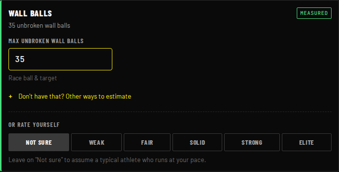

## 7. Check your confidence

The confidence panel shows your range (for example ±8%) and colour-codes each ability as measured, estimated,
self-rated or assumed. It also tells you which single input would narrow the range most.

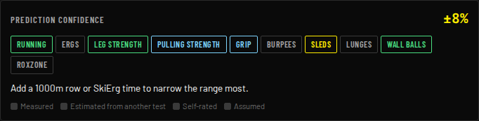

## 8. Read your race plan

The results board mirrors the official results page: every run and station with pace or load and a running total, then
Roxzone Time, Run Total, Work Total and Overall Time. At the top you get a likely range and an estimated field position.

## 9. Lock in splits you already know

Tap any station time to type your own. It turns green, and the total updates around it. Tap ✕ to go back to the
prediction.

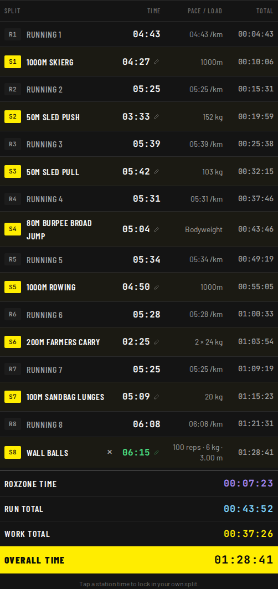

## 10. Watch the race simulator

Press **Simulate** to play your race back along the run / station / Roxzone timeline, with a live clock.

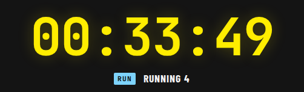

## 11. Doubles: split the work

In doubles, fill in both partners using the athlete tabs. You run together, and for each station the app picks the
fastest work split (**Auto**). You can also drag the slider to plan your own split.

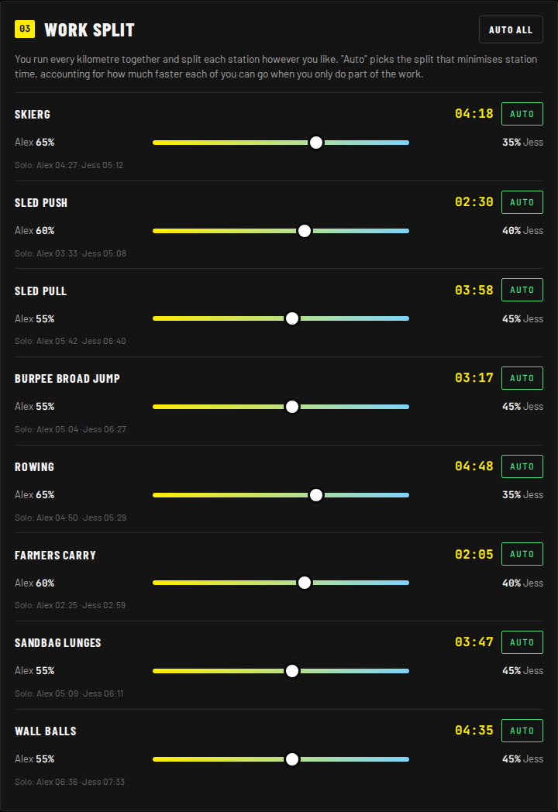

## 12. Relay: choose the order

Four athletes each run 2 × 1 km and do 2 stations. The app picks the fastest leg order, or you can assign athletes
yourself.

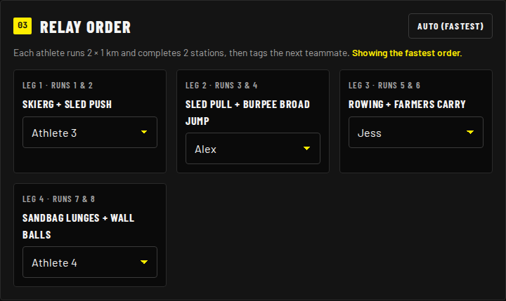

## 13. Keep your inputs (optional)

Nothing is saved by default. Tick **Save my inputs on this device** to keep them in this browser for next time. Untick
it to delete them. Nothing ever leaves your device.

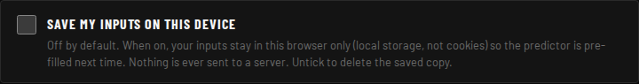

## On your phone

The layout is built for iPhone. A summary bar at the bottom always shows your finish time; tap **View splits** to jump
to the full board.

| Form | Results |
|---|---|
| 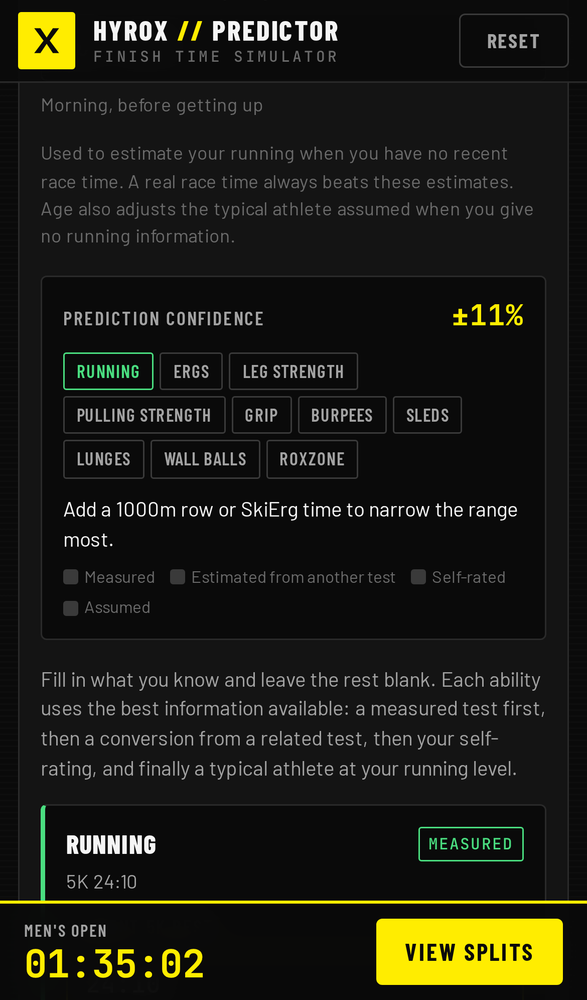 |  |

---

_Screenshots are generated by `npm run docs:screenshots` (Playwright), so they always match the current UI._
