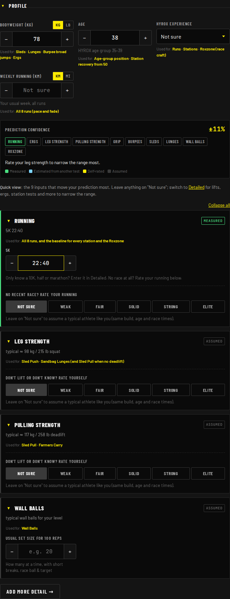
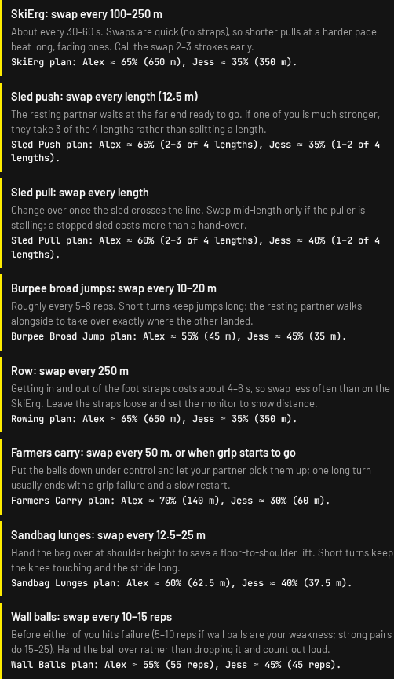
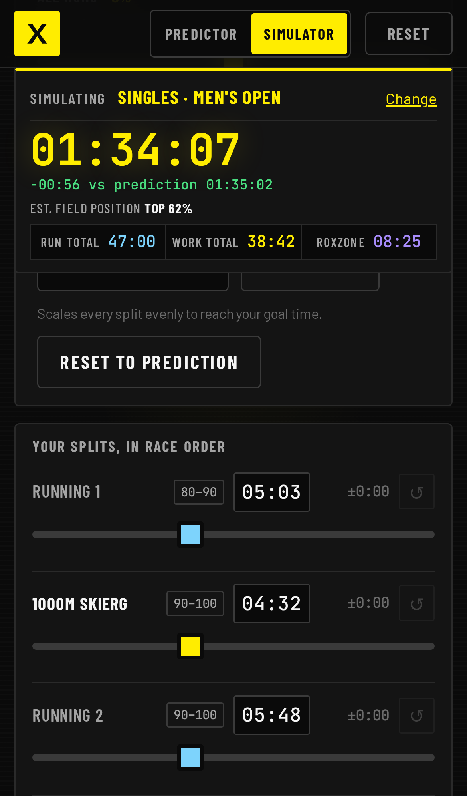

# How to use the HYROX Predictor

A five-minute walkthrough. Every field is optional: enter what you know, leave the rest blank, and the
prediction updates as you type.

**Open the app:** https://johnpapa.github.io/hyrox-predictor/

---

## Quick or Detailed?

The form opens in **Quick**: the 9–10 inputs that move the prediction most (age, bodyweight, HYROX experience,
weekly running, 5K or a running rating, leg and pulling strength ratings, your usual wall-ball set size, and sex only where the division doesn't decide it). They're the same
fields, in the same units, as the full form. Switch to **Detailed** at the top of the Athlete panel for everything else
(other races, lifts, ergs, station tests, physiology, previous result); anything you enter there keeps counting when you
switch back, and Quick lists what it's still using.

Long sections collapse: click a title (▾) to fold it away, or use **Collapse all** above the ability cards.

## 1. Pick your division

Choose Singles (Open, Pro, Elite 15, Adaptive), Doubles, or Relay. Loads such as sled weights, kettlebells, the sandbag
and the wall ball switch automatically. Divisions with special rules show a note, for example mixed doubles weights or
the doubles 10-second rule.

## 2. Tell it about yourself

Name, bodyweight (switch **KG / LB** right on the field), height, age, HYROX experience, **weekly running
distance** (km or mi) and **other training hours** (gym, HYROX classes, erg or sled work). Sex is only asked in Adaptive and
Corporate Relay; every other division decides it. Running and other training are separate because
research shows running volume is what predicts HYROX times; gym hours help the stations a little.
Type a value, or use the **− / +** buttons (hold to repeat) or the arrow keys. Anything unrealistic is flagged right
on the field and ignored.
Anything you don't know can stay on **Not sure**.
Age shows your HYROX age group, and your field position is also estimated within it (e.g. **Top 17% of Men
50–54**). Under **Physiology** you can add body fat % and VO₂max (lab or watch):
- **Body fat:** a lean athlete is assumed stronger when lifts are unknown.
- **VO₂max:** estimates your running without a race time, and gets a small weight when you have one.

Under every field, **Used for** shows which parts of the race it feeds (e.g. weekly running → all 8 runs).

## 3. Running: the strongest predictor

Enter any recent races you know: **5K, 10K, half marathon and marathon**, as many as you have. The app blends them.
10K and half marathon count most because they match a HYROX effort; the 5K reflects your top-end fitness; the
marathon counts least. A short plus a long race also tells it how well you hold pace, which nudges your HYROX laps.
(The 1-mile and Cooper tests were removed: research shows they're too anaerobic to reflect a HYROX effort.)

## 4. Strength: your usual working set is enough

No max test needed. Enter the weight and reps of the set you usually do (e.g. 3 × 10), then pick **How hard was the
set?**: to failure, 1–2 reps left (the default), 3–4 left or 5+ left. The app adds the reps you had left and estimates
your 1RM (60 kg × 10 with 1–2 left ≈ 83 kg). No squat? A front squat, deadlift, trap-bar, Romanian deadlift or leg press
is converted for you.

## 5. No numbers? Rate yourself

Every ability has a **Weak / Fair / Solid / Strong / Elite** scale. Each level has a concrete description, so
"Strong" means the same to everyone. **Not sure** assumes a typical athlete who runs at your pace. It never skews the
result; it only widens the range.

## 6. Station benchmarks

Grip (dead hang, pull-ups), burpees per minute, wall balls (your usual set size for 100 reps, max unbroken, or 100 for time) and fresh station
tests (sled push/pull, lunges, farmers carry, burpee broad jumps) sharpen individual stations. Implausible entries are
ignored with a warning.

## 7. Check your confidence

The confidence panel shows your range (for example ±8%) and colour-codes each ability as measured, estimated,
self-rated or assumed. It also tells you which single input would narrow the range most.

## 7b. Watch every change land

Every change you make briefly shows how much it moved your finish time, for example **▼ −0:39 faster**. On a phone the
bar at the bottom always shows your time. On a laptop a floating time appears whenever the results clock scrolls out
of view.

## 8. Read your race plan

The results board mirrors the official results page: every run and station with pace or load and a running total, then
Roxzone Time, Run Total, Work Total and Overall Time. At the top you get a likely range and an estimated field position.

## 8b. Read your Insights

Under the results, **Your build and background** shows what your bodyweight, body fat, height, age, first race, weekly
running and other training do to your finish time (for example: 40 mi/week −1:41, age 54 +0:29).

**Vs. athletes like you** then compares each station with athletes who share all of that, plus your race times, but are
typical on everything trainable. It shows your biggest limiters and strengths. **Tap a station to see why** it differs
(for example: wall balls, 20 unbroken +1:36; deadlift 1RM ≈ 85 kg vs ≈ 154 kg for athletes like you), and read the
**main reasons overall** above the bars. Then:
- **Realistic gains in 8–12 weeks:** only for things you actually entered or rated, sized for your level and age (a
  well-trained 54-year-old gets about 1% on the 5K, not "a minute faster"). Each one re-runs the whole prediction.
- **Worth measuring:** anything you left on "Not sure", ranked by how much the answer could move your finish time. The
  app never invents a squat or deadlift for you.
- **Practical tips:** technique and race-craft for your weakest stations, plus pacing and Roxzone advice. In doubles you
  also get **how to split each station**: how often to switch (e.g. row every 250 m, wall balls every 10–15 reps) and
  how much each partner does. You also get
notes on your running and race-day pacing, including whether your laps or your station work is your relative
strength. In doubles and relay, switch between athletes at the top of the panel.
Everything is calculated in your browser; no AI and no data leaves your device.

## 9. Lock in splits you already know

Tap any station time to type your own. It turns green, and the total updates around it. Tap ✕ to go back to the
prediction.

## 10. Watch the race simulator

Press **Simulate** to play your race back along the run / station / Roxzone timeline, with a live clock.

## 11. Doubles: split the work

In doubles, fill in both partners using the athlete tabs. You run every kilometre together, so **the slower runner sets
the pace**; the app tells you who that is, and says so if their pace is only assumed. Every station starts at
**50/50**. Drag a slider (20–80%) to plan your own split, or tap **Suggest a split** for a practical plan that gives
each of you more of what you're faster at.

Insights then turns that split into a hand-over plan: how often to switch on each station and how much each of you
does.

## 12. Relay: choose the order

Four athletes each run 2 × 1 km and do 2 stations. The app picks the fastest leg order, or you can assign athletes
yourself.

## 13. Keep your inputs (optional)

Nothing is saved by default. Tick **Save my inputs on this device** to keep them in this browser for next time. Untick
it to delete them. Nothing ever leaves your device.

## 14. Play with the Simulator page

Open **Simulator** in the header, or go straight to `…/#simulator`. It starts from your prediction, with a slider (and a
time box) for every run, every station and the Roxzone:
- The clock, the difference from your prediction and your estimated field position update as you drag.
- Tags such as **80–90** show which finish band each split is typical of.
- Use **All runs** / **All stations** to scale a whole group.
- Enter a **Target finish** and press **Hit target** to scale everything to that time.
- **Reset to prediction** starts over.

## On your phone

The layout is built for iPhone. A summary bar at the bottom always shows your finish time; tap **View splits** to jump
to the full board.

| Form | Results | Simulator |
|---|---|---|
|  |  |  |

---

_Screenshots are generated by `npm run docs:screenshots` (Playwright), so they always match the current UI._
